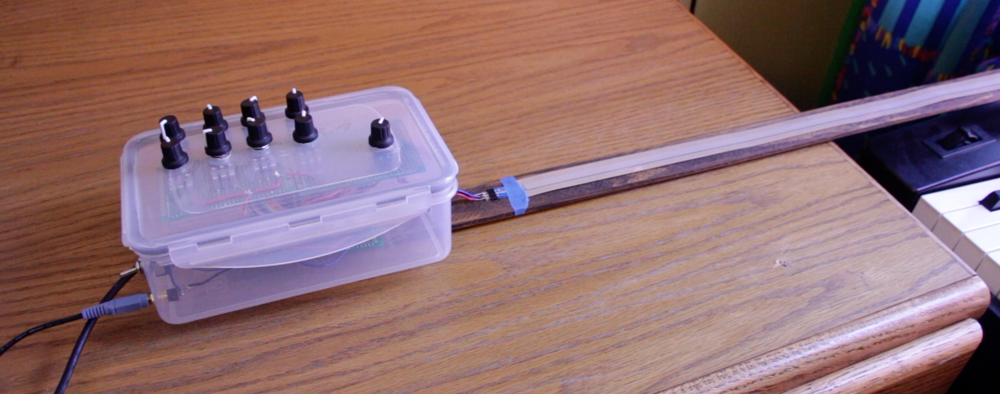
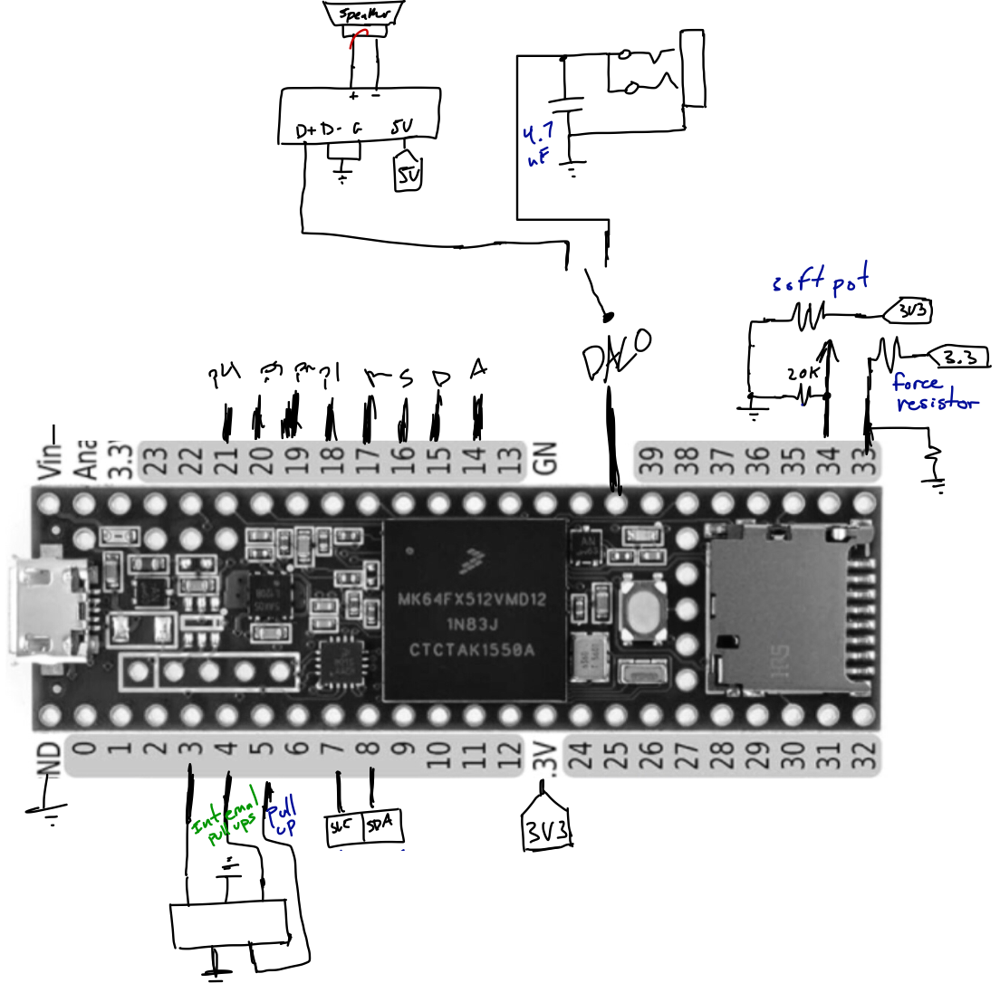
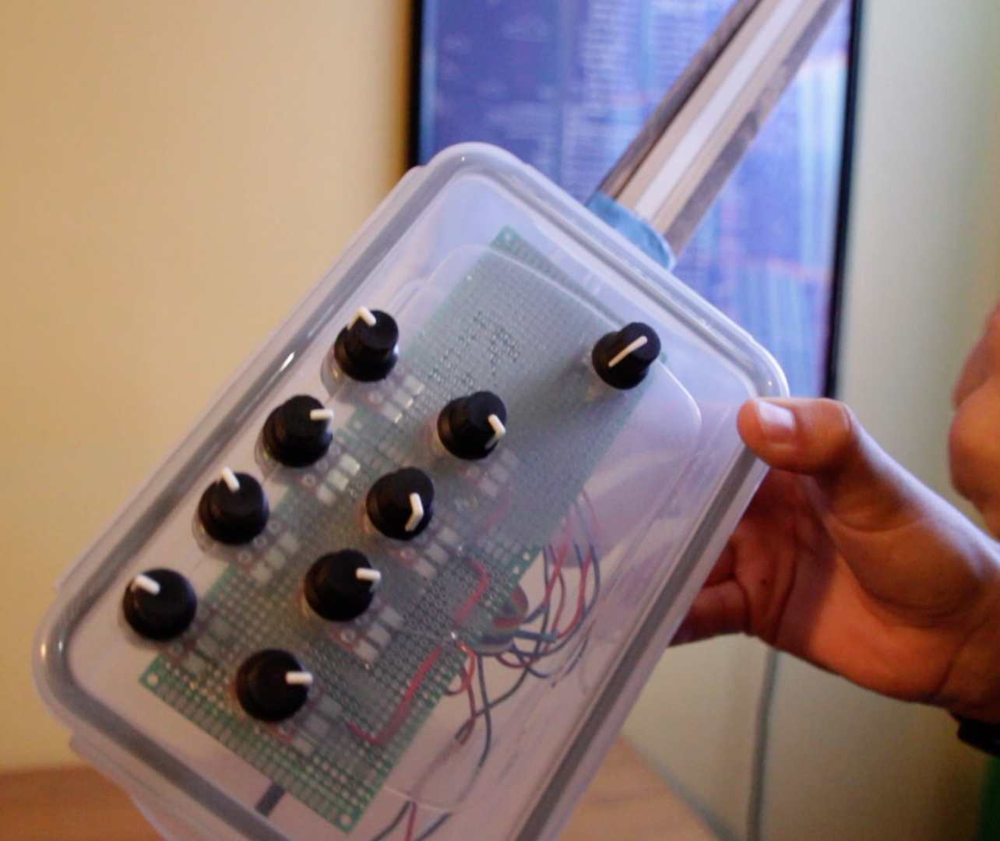

# Omniolin

A synth played kind of like a violin.

Can synthesize sound (using [Mozzi](https://sensorium.github.io/Mozzi/)) to the analog pin as well as send MIDI over USB.

**[Video demo TODO](#TODO)**

Inspired by: [The Modulin](https://www.youtube.com/watch?v=MUdWeBYe3GY)

## Code structure

The code is an adapting prototype, so expect it to be a messy at places. Hardware learning was the focus for me on this project (where I lacked the most).

Written using the Platform.io build system. So, main code is in `src/`. Written for use on a Teensy 3.X.

## Hand drawn schematic

<small>Note: this Teensy 3.5 was used for its abundance of analog pins, so I didn't need to deal with a multiplexer.</small>

